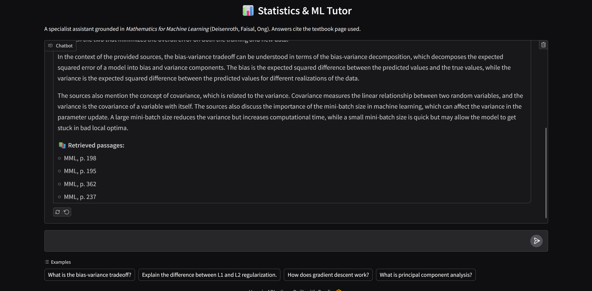

# 📊 Statistics & ML Tutor — RAG Chatbot

A retrieval-augmented chatbot that answers statistics and machine learning
questions by grounding every response in a reference textbook and citing the
exact page used — no invented sources.

<!-- Replace with a real screenshot or GIF of the Gradio interface, ideally
     showing a question, the answer, and the "📚 Retrieved passages" block -->


## What it does

Ask a question like *"Explain the difference between L1 and L2
regularization"* and the chatbot:

1. Retrieves the most relevant passages from *Mathematics for Machine
   Learning* (Deisenroth, Faisal, Ong)
2. Generates an answer grounded in that context
3. Lists the exact source pages used — e.g. `MML, p. 267, 268, 307, 387`

If the retrieved context doesn't cover the question, the model says so
explicitly and marks any general-knowledge answer as such, rather than
guessing.

## Architecture

```
question ─▶ retriever (FAISS + MiniLM embeddings) ─▶ top-k chunks
                                                          │
                                                          ▼
question + chunks ─▶ Mistral-7B-Instruct (4-bit) ─▶ streamed answer + citations
```

- **LLM:** `mistralai/Mistral-7B-Instruct-v0.3`, loaded in 4-bit (NF4) via
  `bitsandbytes` — runs on a single 15GB GPU (developed/tested on a Colab T4)
- **Retrieval:** PDF chunked with `RecursiveCharacterTextSplitter`
  (1000 chars, 150 overlap), embedded with
  `sentence-transformers/all-MiniLM-L6-v2`, indexed in FAISS
- **Citations:** source list is assembled from retrieval metadata, not
  generated by the model — so citations can't be hallucinated
- **Streaming:** token-by-token output via `TextIteratorStreamer`
- **UI:** Gradio `ChatInterface`

## Project structure

```
src/
├── model.py      # loads the quantized LLM
├── ingest.py     # downloads textbook, builds the FAISS index
├── rag_chat.py   # retrieval + prompting + generation + citation logic
└── app.py        # Gradio entrypoint
notebooks/
└── demo.ipynb    # walkthrough notebook using the src/ modules
```

## Setup

Requires a GPU (developed on a Colab T4, ~15GB VRAM) and a Hugging Face
account with access to Mistral-7B-Instruct-v0.3 (gated model — accept the
license on the model page first).

```bash
pip install -r requirements.txt

export HF_TOKEN=your_huggingface_token

# Build the retrieval index (downloads the textbook PDF, one-time)
python -m src.ingest

# Launch the chatbot
python -m src.app
```

## What I'd add next

- Swap in a smaller/faster model for CPU-only inference
- Support multiple source textbooks (the original version indexed ISLP and
  ESL alongside MML; dropped for a cleaner single-source demo)
- Evaluation: retrieval precision/recall against a small hand-labeled
  question set, rather than only spot-checking answers manually

## Notes on sources

The textbook PDF is downloaded by `ingest.py` from the authors' official
free distribution and is **not** committed to this repo (see
`.gitignore`) — running `ingest.py` fetches it fresh.
